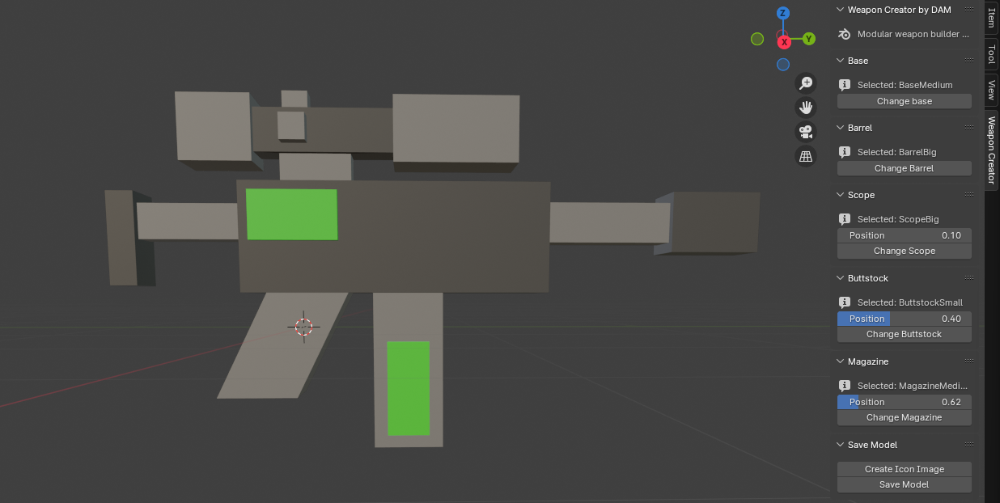
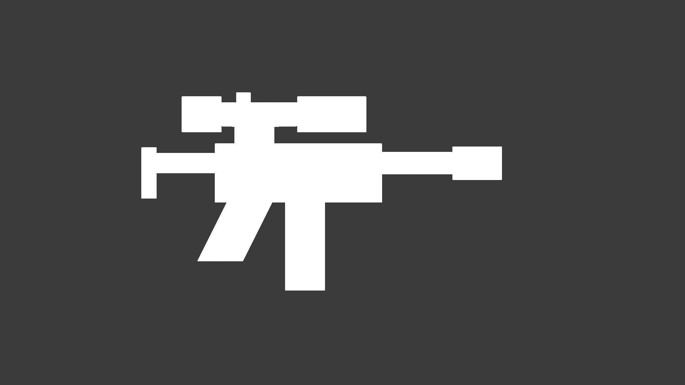

# Blender Weapon Creator by DAM

Welcome to the Modular Weapon Builder, a Blender addon designed to simplify the process of creating custom weapons for your projects. With an intuitive interface, this addon allows you to assemble a weapon from a variety of bases, barrels, scopes, buttstocks, and magazines with just a few clicks. No manual adjustment required - just select your components and adjust their positions with easy-to-use sliders.

## Requirements
- Blender 4.0 or newer
- The "project.blend" blender project

## Features
- Modular Design: Choose from a selection of bases, barrels, scopes, buttstocks, and magazines to create your ideal weapon.
- Easy Customization: Use sliders to adjust the position of each component, ensuring they fit perfectly together.
- Instant Previews: See your weapon take shape in real-time as you select and adjust each part.
- User-Friendly Interface: All functionality is accessible through a dedicated panel in the Blender 3D Viewport UI.

## Installation
1. Download the latest version of the Modular Weapon Builder addon from the Releases section.
2. Open Blender and go to Edit > Preferences > Add-ons.
3. Click Install and navigate to the downloaded .zip file.
4. Find the Modular Weapon Builder addon in the list and check the box to enable it.
5. A new tab named "Weapon Creator" will appear in the 3D Viewport's UI panel.

## How to Use
1. Select a Base: Start by choosing a base for your weapon.
2. Add Components: Navigate through the tabs labeled "Barrel", "Scope", "Buttstock", and "Magazine" to add each component to your weapon.
3. Adjust Positioning: Use the sliders available in each tab to adjust the position of the components as needed.
4. Preview and Edit: View your weapon in real-time as you build. Feel free to switch components and adjust positions until you're satisfied with the result.
5. Create an icon from the weapon
6. Save the weapon as an ".fbx" file